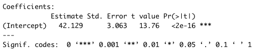
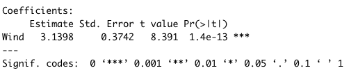

# Recap / Basics {#recap}

```{=html}
<!-- Put this here (right after the first markdown headline) and only here for each document! -->
<script src="./scripts/multipleChoice.js"></script>
```


## Simple Linear Regression

```{=html}

```

To fit our first regression, we will used the data set airquality, which is built-in in R. If you don't know the data set, have a look at the description via

```{r chunk_chapter3_chunk0, echo=TRUE, eval=FALSE}
?airquality
```

and at the variables via

```{r chunk_chapter3_chunk1, echo=TRUE, eval=FALSE}
str(airquality)
```

To get started, let's say we want to examine the relationship between Ozone and Wind. Let's visualize this first:

```{r chunk_chapter3_chunk2, echo=TRUE}
plot(Ozone ~ Wind, data = airquality)
```

OK, I would say there is some dependency there. If you want, you could also run

```{r chunk_chapter3_chunk3, echo=TRUE, eval=FALSE}
cor(airquality$Ozone, airquality$Wind, use = "complete.obs")
```

to get the (Pearson) correlation, which is negative: -0.6015465.

What we want to do now is fitting regression models through the data with the lm() function of R. The function name lm is short for "linear model". However, remember from the basic course: This model is not called linear because we necessarily fit a linear function. It's called linear because we express the response (in our case Wind) as a polynomial of the predictor(s). That means, the predictors have linear coefficients but they might themselves be for example quadratic or sinus terms. So $y = \operatorname{f}(x) + \mathcal{N}(0, \sigma)$, where $\operatorname{f}$ is a polynomial, e.g. ${a}_{0} + {a}_{1} \cdot x + {a}_{2} \cdot {x}^{2}$, and $\mathcal{N}(0, \sigma)$ means that we assume the data scattering as a normal (Gaussian) distribution with unknown standard deviation $\sigma$ around $\operatorname{f}(x)$. The model is called linear because when estimate the unknown parameters (we call them "*effects*") of the polynomial. We will see that they are all affecting the predictions linearly, and can thus be solved as a system of linear equations. 


### Fitting and Interpreting the Regression

For fitting a line through this data, we have 3 options:

1. Fit a horizontal line (intercept only).
2. Fit only the slope, but assume the line goes through the origin (0, 0).
3. Fit slope and intercept.

Option 3 is the most common case, but we will discuss all 3 options here. 


**Intercept Only Model**

The following code fits an intercept only model, meaning that we assume the line is perfectly flat, and we only adjust it's height (the intercept).

```{r chunk_chapter3_chunk4, echo=TRUE, eval=TRUE, results='hide'}
fit = lm(Ozone ~ 1, data = airquality)
```

We can visualize the result via

```{r chunk_chapter3_chunk5, echo=TRUE, eval=TRUE}
plot(Ozone ~ Wind, data = airquality)
abline(fit)
```

and get a summary of the fitted regression coefficients via

```{r chunk_chapter3_chunk6, echo=TRUE, eval=TRUE, results='hide'}
summary(fit)
```

We will talk more about this summary later, but for the moment, let's look only at the coefficients. 

```{=html}

```

This tells us that

* We estimate the mean Ozone (our line) to be at $42.12 \pm 3.1$ units.
* The value is significantly different from zero (the t-test always tests ${H}_{0}$: "The estimate is zero"). 

By the way, the value for the intercept is identical to `mean(airquality$Ozone, na.rm = T)`. This is no accident, as the mean is the maximum likelihood estimation for the mean of the normal distribution.


**Slope Only Model**

Although rarely sensible, you can also fit a model with just a slope. This only makes sense if you are sure that the line must go through the origin (0, 0) for physical or biological reasons.

```{r chunk_chapter3_chunk7, echo=TRUE, eval=TRUE, results='hide'}
fit = lm(Ozone ~ 0 + Wind, data = airquality)
summary(fit)
```

In the results, you can see that we estimate a positive slope, in contradiction to our visual assessment that the data seems negatively correlated. this is because we are forcing the line to go through the origin (0, 0).

```{=html}

```

```{r chunk_chapter3_chunk8, echo=TRUE, eval=TRUE}
plot(Ozone ~ Wind, data = airquality)
abline(fit)
```


**Slope and Intercept**

The most common case will be a model with slope and intercept which is probably corresponds most with our visual assessment. This time, we show the full regression table, so that we can also discuss the other outputs.

```{r chunk_chapter3_chunk9, echo=TRUE, eval=TRUE}
fit = lm(Ozone ~ Wind, data = airquality)
plot(Ozone ~ Wind, data = airquality)
abline(fit)
summary(fit)
```

* "*Call*" repeats the regression formula.
* "*Residuals*" gives you an indication about how far the observed data scatters around the fitted regression line / function.
* The *regression table* (starting with "Coefficients") provides the estimated parameters, one row for each fitted parameter. The first column is the estimate, the second (standard error) is the 0.63 confidence interval (for 0.95 confidence interval multiply with 1.96), and the forth column is the p-value for a two-sided test with ${H}_{0}$: "Estimate is zero". The t-value is used for calculation of the p-value and can usually be ignored.
* The last section of the summary provides information about the *model fit*.
  + Residual error = standard deviation of the residuals,
  + 114 df = degrees of freedom = observed - fitted parameters.
  + R-squared $\left({R}^{2}\right)$ = how much of the signal, respective variance is explained by the model, calculated by $\displaystyle 1 - \frac{\text{residual variance}}{\text{total variance}}$.
  + Adjusted R-squared = adjusted for model complexity.
  + F-test = test against intercept only model, i.e. is the fitted model significantly better than the intercept only model (most relevant for models with > 1 predictor).


```{=html}
  <hr/>
  <strong><span style="color: #0011AA; font-size:25px;">Discussion</span></strong><br/>
```

What is the meaning of "An effect is not significant"?

```{=html}
  <details>
    <summary>
      <strong><span style="color: #0011AA; font-size:25px;">Solution</span></strong>
    </summary>
    <p>
```

You should NOT say that the effect is zero, or that the null hypothesis has been accepted. Official language is "there is no significant evidence for an effect(p = XXX)". If we would like to assess what that means, some people do a post-hoc power analysis (which effect size could have been estimated), but better is typically just to discuss the confidence interval, i.e. look at the confidence interval and say: if there is an effect, we are relatively certain that it is smaller than X, given the confidence interval of XYZ. 

```{=html}
    </p>
  </details>
  <br/>
```

```{=html}
  <hr/>
  <strong><span style="color: #0011AA; font-size:25px;">Discussion</span></strong><br/>
```

Is an effect with three *** more significant / certain than an effect with one *?

```{=html}
  <details>
    <summary>
      <strong><span style="color: #0011AA; font-size:25px;">Solution</span></strong>
    </summary>
    <p>
```

Many people view it that way, and some even write "highly significant" for *** . It is probably true that we should have a slightly higher confidence in a very small p-value, but strictly speaking, however, there is only *significant*, or *not significant*. Interpreting the p-value as a measure of certainty is a slight misinterpretation. Again, if we want to say how certain we are about the effect, it is better to look again at the confidence interval, i.e. the standard error and use this to discuss the precision of the estimate (small confidence interval / standard error = high precision / certainty).

```{=html}
    </p>
  </details>
  <br/>
```

```{=html}
  <hr/>
  <strong><span style="color: #0011AA; font-size:25px;">Task</span></strong><br/>
```

Fit simple (univariate) linear regression models for the other two numeric variables (Temp and Solar.R) and interpret the results with your partner. 

```{=html}
  <details>
    <summary>
      <strong><span style="color: #0011AA; font-size:25px;">Solution</span></strong>
    </summary>
    <p>
```

```{r chunk_chapter3_task_0, message=FALSE, warning=FALSE}
fit = lm(Ozone ~ Temp, data = airquality)
summary(fit)
plot(Ozone ~ Temp, data = airquality)
abline(fit)
```

Temperature seems to have a positive effect of Ozone and this effect is significant. The intercept (value for Ozone at Temp = 0) is negative and also significant. This model explains nearly 50% of the variance of the given data. This holds even for the complexity adjusted ${R}^{2}$ measure. 37 observations have missing data and are omitted. Compared to the model with only an intercept, this model is significantly different.

```{=html}
  <br/><hr/><br/>
```

```{r chunk_chapter3_task_1, message=FALSE, warning=FALSE}
fit = lm(Ozone ~ Solar.R, data = airquality)
summary(fit)
plot(Ozone ~ Solar.R, data = airquality)
abline(fit)
```

Solar.R seems to have a positive effect of Ozone and this effect is significant. The intercept (value for Ozone at Solar.R = 0) is positive and also significant. This model explains slightly more than 10% of the variance of the given data. This holds even for the complexity adjusted ${R}^{2}$ measure. 42 observations have missing data and are omitted. Thus this model has not the power of the previous one. Compared to the model with only an intercept, this model is significantly different.

```{=html}
    </p>
  </details>
  <br/><hr/>
```


### Centering of Predictors

In the last model

```{r chunk_chapter3_chunk10, echo=TRUE, eval=FALSE}
fit = lm(Ozone ~ Wind, data = airquality)
summary(fit)
```

we saw an intercept of 96 for the wind parameter:

```{=html}

```

Per definition, the intercept is the predicted value for $y$ (Ozone) at $x$ (Wind) = 0. It's fine to report this, as long as we are interested in this value. However, there are certain situations where the value at predictor = 0 is not particularly interesting. Let's look at the regression for Temp, for example: 

```{r chunk_chapter3_chunk11, echo=TRUE, eval=FALSE}
fit = lm(Ozone ~ Temp, data = airquality)
summary(fit)
```

```{=html}

```

Here, the intercept is -146, which doesn't make much sense for an Ozone concentration, which should be positive. We can see the reason wehn we plot the results: 

```{r chunk_chapter3_chunk12, echo=TRUE, eval=TRUE}
plot(Ozone ~ Temp, data = airquality, xlim = c(-10, 110), ylim = c(-200, 170))
abline(fit)
abline(h = 0, lty = 2)
abline(v = 0, lty = 2)
```

That shows us that the value 0 is far outside of the set of our observed values for Temp, which is measured in Fahrenheit. Thus, we are extrapolating the Ozone far beyond the observed data. What we can do to avoid this is to simply re-define the x-Axis, by subtracting the mean: 

```{r chunk_chapter3_chunk13, echo=TRUE, eval=TRUE}
airquality$cTemp = airquality$Temp - mean(airquality$Temp)
```

Fitting this 

```{r chunk_chapter3_chunk14, echo=TRUE, eval=FALSE}
fit = lm(Ozone ~ cTemp, data = airquality)
summary(fit)
```

```{=html}

```

produces a more interpretable value for the intercept. We can see this also visual if we plot the results, i.e. the Ozone concentration at the mean observed temperature. 

```{r chunk_chapter3_chunk15, echo=TRUE, eval=TRUE}
plot(Ozone ~ cTemp, data = airquality)
abline(fit)
abline(v = 0, lty = 2)
```

Note that the intercept of the centered variable will typically be very similar to the grand mean  
`fit(Ozone ~ 1, data = airquality)')`{.R}.

```{r chunk_chapter3_chunk16, echo=TRUE, eval=TRUE}
mean(airquality$Temp)
mean(airquality$cTemp)
coef(fit)
```

```{=html}
  <hr/>
  <strong><span style="color: #0011AA; font-size:25px;">Task</span></strong><br/>
```

Define new variables through linear transformations, meaning that you either subtract / add something to the variable, or divide the variable by a certain value. Understand how this changes the regression's estimates.

```{=html}
  <details>
    <summary>
      <strong><span style="color: #0011AA; font-size:25px;">Solution</span></strong>
    </summary>
    <p>
```

```{r chunk_chapter3_task_2, message=FALSE, warning=FALSE}

```

```{=html}
    </p>
  </details>
  <br/>
```

```{=html}
  <hr/>
  <strong><span style="color: #0011AA; font-size:25px;">Pro Task</span></strong><br/>
```

Why do the confidence intervals (std. error) in the two models (centered and uncentered) differ? Do we fit different models? To get an idea, look at the standard effect plots, then run

```{r chunk_chapter3_task_4, message=FALSE, warning=FALSE, eval=FALSE}
preList = list(cTemp = seq(-10, 110, 1))
plot(Effect("cTemp", fit,  xlevels = preList))
```

(mind the library "effects") and compare `vcov(fit)`{.R} (calculates variance-covariance matrix) for both models. 

```{=html}
  <details>
    <summary>
      <strong><span style="color: #0011AA; font-size:25px;">Solution</span></strong>
    </summary>
    <p>
```

```{r chunk_chapter3_task_5, message=FALSE, warning=FALSE}
library(effects)

fit1 = lm(Ozone ~ Temp, data = airquality)
summary(fit1)

fit2 = lm(Ozone ~ cTemp, data = airquality)
summary(fit2)

vcov(fit1)
vcov(fit2)

plot(Ozone ~ Temp, data = airquality, xlim = c(-50, 110), ylim = c(-100, 170))
abline(fit1)

plot(Ozone ~ cTemp, data = airquality, xlim = c(-50, 110), ylim = c(-100, 170))
abline(fit2)

preList = list(Temp = seq(-10, 110, 1))
plot(effect("Temp", fit1,  xlevels = preList))

preList = list(cTemp = seq(-10, 110, 1))
plot(effect("cTemp", fit2,  xlevels = preList))
```

```{=html}
    </p>
  </details>
  <br/><hr/>
```


### Residual Checks


### Categorical Predictors


### Exercise: Global Plant Trait Analysis


## Multiple Regression


### Getting Started


### Simulating the Effect of Collinearity


### Scaling Variables


### ANOVA for Multiple Regression


### Interactions


### Exercise: Global Plant Trait Analysis


## Model Choice and Causal Inference


### The Bias-Variance Tradeoff


### Causal inference


### Model selection methods


### Problems of step-wise model selection


### Exercise: global plant traits #3


